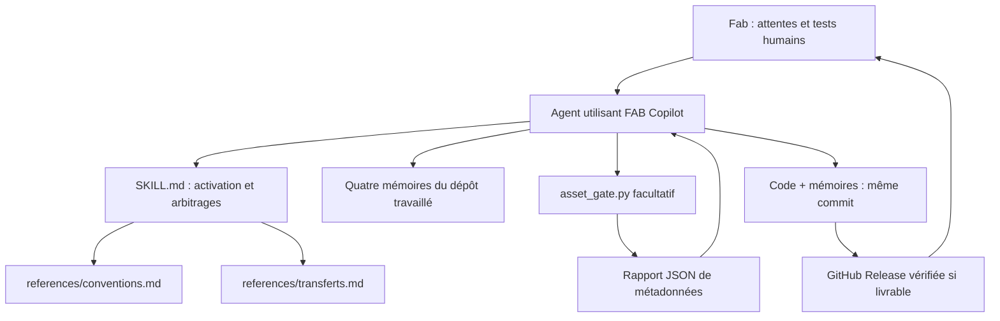
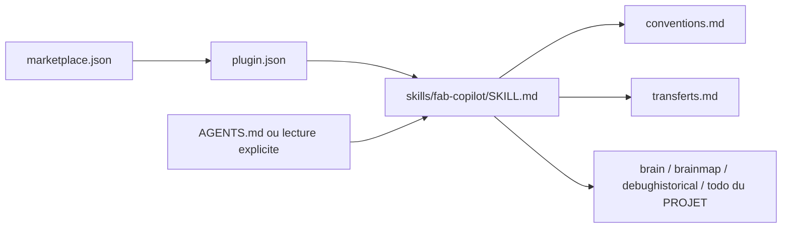
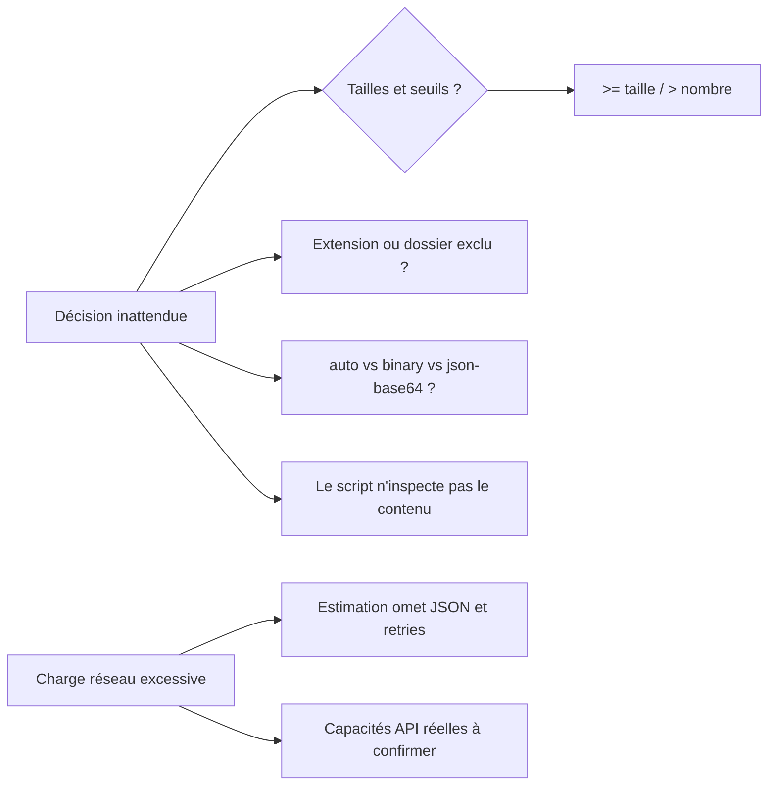
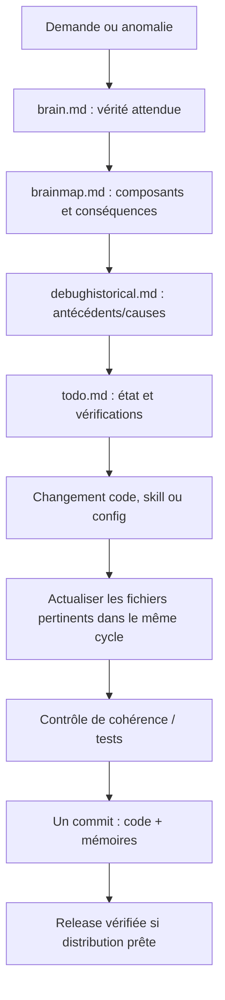
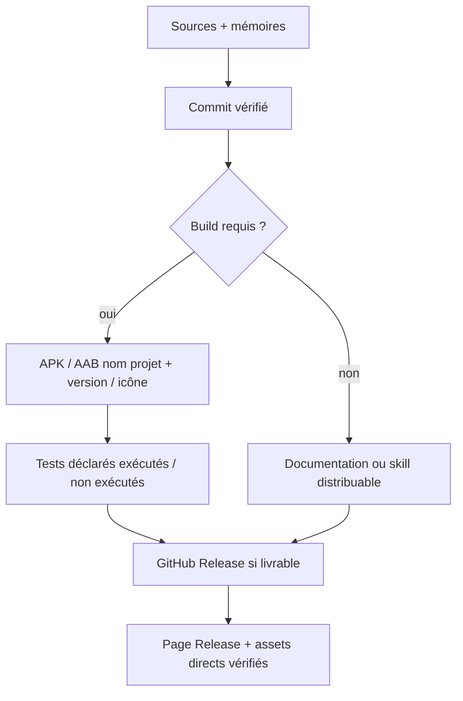

# 🗺️ FAB Copilot — brainmap.md
> Cartographie technique **complète et navigable** de l'état connu du dépôt, et non résumé volontairement simplifié.
> Synchronisation initiale : 2026-09-21 · Base examinée : `4c0f541d09331ea59bdd19d23f848eee123342c0`.
> Ce document distingue les liens vérifiés dans les fichiers du dépôt des comportements à tester dans les environnements externes.

## Sommaire
1. [Périmètre et architecture](#1-périmètre-et-architecture)
2. [Arbre du dépôt et responsabilités](#2-arbre-du-dépôt-et-responsabilités)
3. [Chargement de la skill et diffusion](#3-chargement-de-la-skill-et-diffusion)
4. [Boucle décisionnelle de FAB Copilot](#4-boucle-décisionnelle-de-fab-copilot)
5. [Cartographie précise du diagnostic des assets](#5-cartographie-précise-du-diagnostic-des-assets)
6. [Mémoires synchronisées et propagation](#6-mémoires-synchronisées-et-propagation)
7. [Version, livraison et confiance](#7-version-livraison-et-confiance)
8. [Dépendances, frontières et invariants](#8-dépendances-frontières-et-invariants)
9. [Tests et éléments à confirmer](#9-tests-et-éléments-à-confirmer)
10. [Points d'entrée par incident](#10-points-dentrée-par-incident)

## 1. Périmètre et architecture
Le dépôt distribue un **plugin de skills documentaire**, pas un service déployé. Les décisions ordinaires de l'agent sont décrites dans Markdown ; un utilitaire Python séparé diagnostique facultativement les métadonnées d'assets. Aucun mécanisme actuellement présent n'intercepte matériellement tous les commits d'autres projets : FAB-MEM-001 est une **obligation imposée à l'agent**, pas une garantie automatique. Le contrôle humain et l'inspection Git restent nécessaires.



## 2. Arbre du dépôt et responsabilités
| Chemin | Nature et rôle | Relation |
| --- | --- | --- |
| `README.md` | Porte d'entrée humaine, installation et liens | Pointe vers skill, protocole et mémoires |
| `AGENTS.md` | Instructions aux agents compatibles | Ordre de lecture, obligation FAB-MEM-001 |
| `plugin.json` | Manifeste de plugin, nom et version | Référence le dépôt ; ne prouve pas l'installation |
| `.agents/plugins/marketplace.json` | Catalogue de marketplace personnelle | Source URL du dépôt, ref main, entrée fab-copilot |
| `skills/fab-copilot/SKILL.md` | Entrée de la skill et boucle d'arbitrage | Charge références pertinentes et mémoire des projets |
| `skills/fab-copilot/references/conventions.md` | Android, architecture, Git, continuité, releases | Complète la skill |
| `skills/fab-copilot/references/transferts.md` | Transferts d'assets et relais humain | Complète la skill et contextualise asset_gate |
| `scripts/asset_gate.py` | Outil local d'inspection **sans lecture de contenu des fichiers** | JSON de diagnostic ; aucun push/release |
| `tests/test_asset_gate.py` | 7 cas unittest pour inspect_assets | Exécution manuelle Python |
| `fab-copilot.example.json` | Exemple de préférences, pas un moteur de règles | Non chargé par asset_gate.py |
| `LICENSE` | Licence du code original | Indépendante des règles métier |
| `brain.md` | Comportements et intentions à préserver | Références stables FAB-* |
| `brainmap.md` | Ce document : architecture et propagation complète connue | Liens à brain, debughistorical, todo |
| `debughistorical.md` | Incidents et décisions de correction, avec niveau de preuve | Ne pas inventer d'incident |
| `todo.md` | État actuel et points non confirmés | Document opérationnel canonique |
| `TODO.md` | Redirection de compatibilité vers todo.md | Éviter deux listes concurrentes |
| `docs/MEMOIRE-VIVANTE.md` | Présentation et protocole détaillé | Source pédagogique de FAB-MEM-001 |

## 3. Chargement de la skill et diffusion

- Le manifeste n'installe pas automatiquement le plugin dans ChatGPT Work. Vérification d'import et activation à faire dans le client ciblé ; cf. `todo.md`.
- La marketplace référence `main` : une modification sur `main` change la source utilisée lors d'un nouvel import ; elle ne démontre pas que la skill déjà installée a été actualisée.
- `AGENTS.md` est un point d'entrée pour les agents qui lisent ce standard. Une session qui n'utilise ni la skill ni AGENTS.md n'est pas magiquement gouvernée par les fichiers.

## 4. Boucle décisionnelle de FAB Copilot
**Fichier source :** `skills/fab-copilot/SKILL.md`.
1. Lire intention et pourquoi ; distinguer exigence, préférence temporaire, hypothèse et incident.
2. Lire les quatre mémoires et les instructions du dépôt travaillé ; délimiter la zone affectée de la carte.
3. Vérifier outillage, branche, droits, transport, volumes, version stable, preuve de commit.
4. Choisir une méthode proportionnée : autonomie pour actions sûres, relais humain pour transfert vraiment fragile.
5. Corriger le contrat/la carte/l'historique/la tâche **pendant** l'intervention, suivant FAB-MEM-001.
6. Exécuter et vérifier les éléments réellement accessibles ; produire commit cohérent.
7. Pour une livraison prête, vérifier la GitHub Release et ses assets nommés ; indiquer les tests non exécutés.

**Points de bifurcation :** incompréhension → brain ; dépendance cachée → brainmap ; symptôme connu → debughistorical ; étape non finie → todo ; asset trop gros → transferts ; version Android → conventions.

## 5. Cartographie précise du diagnostic des assets
**Code observé :** `scripts/asset_gate.py`. **Tests observés :** `tests/test_asset_gate.py`.

### 5.1 Constantes et entrées
- `ASSET_EXTENSIONS` : .png, .jpg, .jpeg, .webp, .gif, .svg, .bmp, .ico, .mp3, .ogg, .wav, .mp4, .webm, .glb, .gltf, .fbx, .ttf, .otf, .woff, .woff2, .zip, .apk, .aab.
- `EXCLUDED_DIRECTORIES` : .git, .venv, node_modules, __pycache__.
- `inspect_assets(root: Path, transport="auto", single_limit=256*1024, batch_limit=2*1024*1024, count_limit=12) -> dict`.
- `main()` : CLI argparse ; `directory`, `--transport` (auto/binary/json-base64), `--single-kib`, `--batch-mib`, `--max-files`.

### 5.2 Pipeline de inspect_assets
```mermaid
flowchart TD
  Arg[Paramètres] --> Check{Transport connu, seuils positifs, répertoire accessible ?}
  Check -- non --> Error[ValueError / argparse.error]
  Check -- oui --> Walk[rglob récursif]
  Walk --> Filter[Exclure répertoires, symlinks, non-fichiers et extensions inconnues]
  Filter --> Stat[stat().st_size, chemins relatifs]
  Stat --> Sort[Trier taille décroissante puis chemin]
  Sort --> Sums[Somme octets + estimation Base64 par fichier]
  Sums --> Heavy{Au moins un seuil atteint ?}
  Heavy -- non --> Continue[continue]
  Heavy -- oui --> Transport{Transport déclaré ?}
  Transport -- binary --> Continue
  Transport -- json-base64 --> Handoff[human-handoff : conseil]
  Transport -- auto --> Verify[check-transport]
  Continue --> JSON[Rapport JSON local]
  Handoff --> JSON
  Verify --> JSON
```
- Validations : valeurs transport parmi 3, limites strictement positives, chemin `expanduser().resolve()` puis `is_dir()`.
- Parcours `root.rglob("*")`, exclut tout chemin contenant un segment interdit ; saute symlinks et non-fichiers, filtre suffixe insensible à la casse.
- Appel `path.stat().st_size` ; ne lit ni n'encode les contenus. Attention : les métadonnées et chemins sortent dans le rapport.
- Trie : `(-bytes, path)` ; total = somme des tailles.
- Estimation Base64 = somme de `4 * ceil(n/3)` par fichier ; **ne comprend pas** overhead JSON/protocole/retries.
- `heavy` si fichier max **>=** `single_limit`, ou total **>=** `batch_limit`, ou nombre de fichiers **>** `count_limit`.
- Si aucun asset : `continue`. Si non heavy : `continue`. Si heavy + binary : `continue` sous réserve des vraies limites. Si heavy + json-base64 : conseil `human-handoff` ; heavy + auto : `check-transport`.
- Rapport : root, transport, asset_count, total_bytes, base64_estimated_bytes, base64_estimate_excludes, thresholds_are_advisory, decision, reason, largest_files[:5], other_files_count, no_bytes_read_or_uploaded.
- `main()` convertit Kio/Mio en octets, transforme ValueError/OSError en erreur argparse et imprime JSON UTF-8 indenté. L'utilitaire ne bloque aucun envoi, n'ouvre aucun canal réseau, ne crée aucun commit.

### 5.3 Causes et chemins de débogage

La correction d'une de ces fonctions impose mise à jour de ce paragraphe, des critères dans `brain.md`, de l'incident si applicable et des tests/tâches.

## 6. Mémoires synchronisées et propagation

**Invariants :** les quatre fichiers existent ; tous quatre sont relus, seuls ceux affectés sont changés ; les identifiants restent stables ; une inconnue n'est pas une preuve ; une modification d'architecture doit corriger la carte ; une régression déclenche une revue de l'exigence, de la carte et de l'historique. Ne jamais créer artificiellement une entrée d'incident pour une simple amélioration.

## 7. Version, livraison et confiance

- `plugin.json` annonce la version de plugin ; `README.md` et la skill doivent rester cohérents.
- GitHub Actions ou commit seuls **ne sont pas** des GitHub Releases. Si l'API courante ne permet pas de publier une release, la signaler comme non créée dans `todo.md`.
- Le dépôt FAB Copilot ne produit pas d'APK/AAB : la règle vise les projets Android utilisant la skill.

## 8. Dépendances, frontières et invariants
| Dépendance | Effet / limite |
| --- | --- |
| Python stdlib `argparse`, `json`, `pathlib` | Utilitaire sans dépendance tierce déclarée |
| Python stdlib `unittest`, `tempfile` | Tests unitaires du diagnostic local |
| GitHub | Stocke sources, commits, marketplace, releases éventuelles |
| Client compatible skills | Doit importer/activer réellement la skill ; hors du contrôle du manifeste seul |
| Canal de transfert réel | Décision asset_gate reste indicative ; limites à confirmer |
| Utilisateur sur téléphone | Seul valide effectivement l'ergonomie et le fonctionnement en conditions réelles |
| `fab-copilot.example.json` | Préférences déclaratives ; n'est pas interprété par le code Python actuel |

## 9. Tests et éléments à confirmer
**Tests présents dans le code (7, résultat d'exécution non revendiqué ici)** : répertoire vide ; petite icône Base64 ; gros fichier JSON/Base64 ; même fichier en binaire ; transport inconnu ; exclusion non-assets/.git et suffixe .PNG ; seuil invalide. Commande : `python -m unittest discover -s tests -v`.
**À confirmer hors dépôt** : installation/activation de la skill dans Work, publication d'une Release par un canal autorisé, fonctionnement du relais Git dans l'environnement réel, politiques de contrôle de synchronisation de commits, scénarios d'intégration multirépos.

## 10. Points d'entrée par incident
- « Nous nous sommes mal compris » → FAB-MEM-003 → `brain.md` → `debughistorical.md`.
- « Un changement casse une autre fonction » → FAB-MEM-001 → carte des dépendances → tests et historique.
- « Il manque des PNG / transfert bloque » → §5 + `transferts.md`.
- « APK introuvable / release absente » → §7 + `conventions.md` + `todo.md`.
- « La skill n'a pas pris en compte ma règle » → §3 + présence des mémoires et version du plugin.
