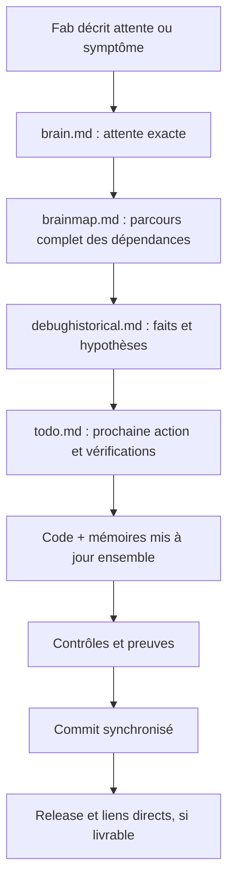

# 🧭 FAB Copilot — Les quatre mémoires vivantes
> **Ordres de Fab distincts + contrat + carte exhaustive + histoire des erreurs + plan technique.**
>
> **Règle d'or : on ne change jamais le code sans faire vivre les mémoires pendant le même travail.**

## Notre promesse de collaboration
Une conversation peut s'interrompre ; le projet ne doit pas perdre sa compréhension. Les fichiers sont des **références vivantes**, jamais une annexe rédigée après le développement. FAB Copilot lui-même suit ce protocole.

| Icône | Fichier | Question |
|---|---|---|
| 🧠 | [brain.md](../brain.md) | Qu'a demandé Fab, exactement ? |
| 🗺️ | [brainmap.md](../brainmap.md) | Comment **tout** fonctionne-t-il et qu'affecte un changement ? |
| 🐞 | [debughistorical.md](../debughistorical.md) | Qu'avons-nous mal compris, cassé et réellement corrigé ? |
| 📜 | [ordres-de-mission.md](../ordres-de-mission.md) | Quelles missions explicites Fab a-t-il ordonnées et lesquelles restent non produites ? |
| ✅ | [todo.md](../todo.md) | Quelles sont mes actions techniques, tests et étapes restantes ? |

## 0 — Mission de Fab ≠ TODO de l'agent (FAB-MISSION-001)

Chaque dépôt consommateur possède `ordres-de-mission.md`, **registre canonique des commandes de Fab**. Le créer si absent ; restaurer les demandes attestées depuis `brain.md` et les fichiers historiques sans inventer ni demander à Fab de retrouver une à une ses commandes. `todo.md` est le **plan d'exécution technique de l'agent**, pas ce registre. `debughistorical.md` décrit les bugs et leurs preuves. `topo.md` demeure facultatif et peut être réservé à l'agent.

Une commande « pour plus tard », « en todo », « code pas » est enregistrée intégralement, sans autorisation de coder si le message l'interdit. **Seul Fab** annule, fusionne, change le périmètre ou la priorité de sa mission. Le passage « À faire » → « En cours » → « Livré, à valider » → « Validé, produit » exige une preuve à chaque stade ; CI seule ne confirme pas un rendu sur téléphone. Archiver une mission produite visiblement, ne jamais la faire disparaître silencieusement.

Pour répondre « que reste-t-il ? », citer **d'abord les missions ouvertes du registre**, puis mes tâches et bugs séparément. Ne jamais compter les anciennes cases TODO comme des demandes utilisateur.

## 1 — Une carte complète, pas un résumé
`brainmap.md` décrit autant de détails techniques que nécessaire : fichiers, composants, classes, fonctions, données, chemins d'exécution, responsabilités, dépendances internes/externes, effets de bord, risques, diagrammes cause → conséquence, tests associés. **Aucune limite artificielle de longueur.** Un sommaire et des identifiants stables permettent de retrouver vite un détail. Une inconnue est marquée, jamais remplacée par une supposition.

## 2 — Une correction de code et de compréhension

Une compréhension imprécise, une architecture incomplète, une hypothèse erronée, un bug et une régression ne se traitent pas comme la même cause. Une décision nouvelle de Fab est inscrite comme telle ; une idée de l'agent ne devient pas rétrospectivement son exigence.

## 3 — Synchronisation en temps réel
**Avant :** lire le registre des missions de Fab et les quatre fichiers du dépôt travaillé, connaître le HEAD et la version stable, retrouver les exigences touchées.

**Pendant chaque modification :** respecter et mettre à jour le statut des missions touchées, ainsi que les sections pertinentes de `brain.md`, `brainmap.md`, `debughistorical.md`, `todo.md`. Examiner chacun des quatre ; ne pas modifier artificiellement un document réellement non affecté. Une architecture changée sans carte actualisée est un travail incomplet.

**Avant commit :** relire cohérence et liens, associer code et documents au même commit ; tests disponibles, blocages et tests humains non réalisés explicités. En interruption, laisser dans `todo.md` l'état vrai et un prochain pas actionnable, sans annoncer de résultat non confirmé.

## 4 — Releases, pas des ZIP d'installation
Une version prête à distribuer est publiée sur GitHub Releases : page de release, liens **directs** vers APK et AAB quand adaptés, vrai nom + vraie version, icône et versions cohérentes. Les archives sources GitHub ne remplacent pas les APK ; les artefacts CI temporaires ne remplacent pas une release. Si la publication n'est pas possible, ne pas annoncer qu'elle existe.

## 5 — Utiliser la méthode sans lourdeur
Cela ne prescrit aucun sous-agent, outil additionnel ni cérémonie par défaut. La mémoire se met à jour au rythme du travail réel. Le relais humain concerne un risque concret (transfert binaire, tests téléphone, accès indisponible), avec explication courte et reprise précise.

**Référence d'exécution :** `skills/fab-copilot/SKILL.md` ; contrat détaillé : [brain.md](../brain.md) ; architecture réelle : [brainmap.md](../brainmap.md).
